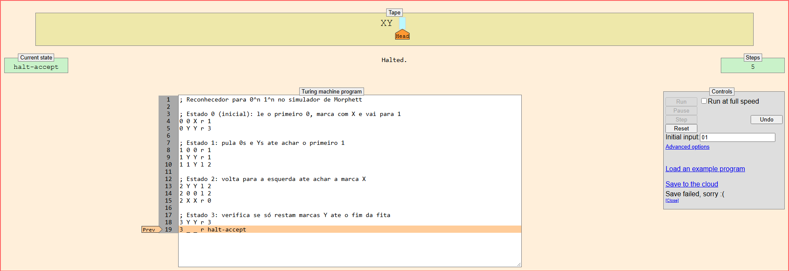
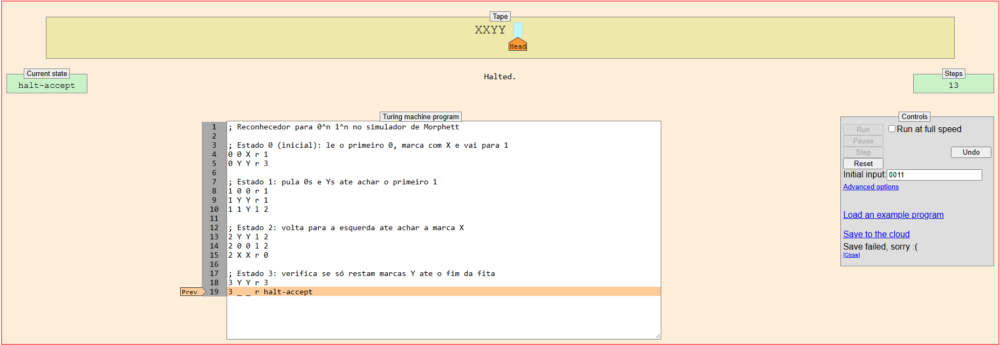
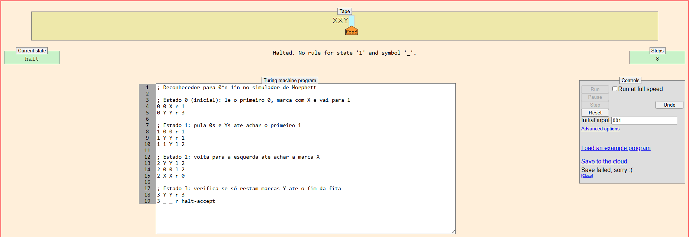

# Relatório de Atividade: Máquinas de Turing (A2)

**Disciplina:** Teoria da Computação / Linguagens Formais e Autômatos  
**Docente:** Profª Kadidja Valéria  
**Aluno:** Edmar Yan Faria de Melo  
**Referência:** Akitando #86 — O Computador de Turing e Von Neumann: Por que calculadoras não são computadores?  
📄 **Arquivo para Entrega (PDF Único):** [Atividade_Maquina_de_Turing_EdmarYan.pdf](./Atividade_Maquina_de_Turing_EdmarYan.pdf)

---

## 1. Etapa 1 — Fundamentação Teórica

### 1. O que é uma Máquina de Turing?
É um modelo matemático abstrato concebido por Alan Turing em 1936 para formalizar e definir rigorosamente o conceito de computação e algoritmo. A máquina opera sobre uma fita linear potencialmente infinita dividida em células discretas, funcionando como memória de trabalho. Uma cabeça de leitura/escrita se posiciona sobre uma célula por vez, podendo ler o símbolo atual, escrever um novo símbolo, alterar seu estado interno (dentro de um conjunto finito de estados) e deslocar a cabeça uma posição para a esquerda (L) ou direita (R). Ela delimita formalmente tudo o que pode ser processado e resolvido de forma puramente mecânica.

### 2. Quais são os principais componentes de uma Máquina de Turing?
Uma Máquina de Turing padrão é composta por quatro elementos essenciais:
- **Fita Infinita:** Memória de trabalho dividida em células, ilimitada, armazenando símbolos do alfabeto ou o símbolo especial de espaço em branco (`_`).
- **Cabeça de Leitura e Escrita:** Mecanismo que acessa a célula atual da fita, lê o caractere presente, grava um novo símbolo e move-se para a esquerda (L) ou direita (R).
- **Conjunto Finito de Estados ($Q$):** Controle interno da máquina com estados finitos bem definidos, incluindo um estado inicial (`0`) e estados terminais de parada e aceitação (`halt-accept` / `halt`).
- **Função / Tabela de Transição ($\delta$):** O conjunto de regras determinísticas que rege o comportamento da máquina a cada passo, baseado no par *(estado atual, símbolo lido)*, determinando o símbolo a ser gravado, o sentido de deslocamento da cabeça e o próximo estado interno.

### 3. Qual é a importância das Máquinas de Turing para a computação?
A Máquina de Turing estabeleceu o divisor de águas entre calculadoras de função fixa (ou cabeadas) e os computadores universais modernos. Com a formulação da **Máquina de Turing Universal (MTU)**, Turing provou que uma única máquina genérica é capaz de receber na fita a descrição de qualquer outra máquina (código de programa) juntamente com os dados e executá-la com fidelidade. Esse princípio do "programa armazenado" serviu de fundação para a Arquitetura Von Neumann e delimita os limites definitivos da computabilidade: qualquer supercomputador ou arquitetura moderna presente ou futura possui exatamente a mesma capacidade computacional do modelo universal de Turing.

### 4. Qual é a relação entre Máquina de Turing e algoritmo?
Pela amplamente aceita **Tese de Church-Turing**, a definição intuitiva de algoritmo (um procedimento finito, mecânico e determinístico para resolver um problema passo a passo) é equivalente à capacidade de computação de uma Máquina de Turing. Isso significa que qualquer tarefa calculável mecanicamente por um algoritmo pode ser descrita e computada por uma Máquina de Turing. Inversamente, se uma tarefa não puder ser resolvida por regras de transição em uma Máquina de Turing, **não existe algoritmo em nenhuma linguagem de programação ou arquitetura capaz de solucioná-la**.

---

## 2. Etapa 2 — Modelagem da Máquina de Turing (Linguagem $0^n 1^n$)

### Desafio Proposto
Projetar uma Máquina de Turing capaz de reconhecer a linguagem livre de contexto e não-regular:
$$L = \{0^n 1^n \mid n \ge 1\}$$
A máquina deve validar se a palavra de entrada é formada por blocos contínuos contendo exatamente a mesma quantidade de símbolos `0` e `1`, nesta ordem específica (ex.: `01`, `0011`, `000111`), rejeitando quaisquer entradas desbalanceadas (como `001`, `011`) ou com símbolos fora de ordem (como `10`, `0101`).

### Descrição da Lógica de Funcionamento
A máquina utiliza o princípio de **emparelhamento cruzado com marcadores de fita**:
1. **Marcação do zero inicial (Estado 0):** Ao encontrar o primeiro símbolo `0`, grava a marcação `X` e transita para o Estado 1, avançando para a direita.
2. **Busca do um correspondente (Estado 1):** Ignora outros `0`s e eventuais marcas `Y` já gravadas, avançando até localizar o primeiro `1` não marcado. Ao encontrá-lo, grava o marcador `Y`, muda para o Estado 2 e inicia o retrocesso para a esquerda.
3. **Retorno ao marcador X (Estado 2):** Retrocede pela fita ignorando símbolos `0` e `Y` até identificar a última marca `X`. Ao achá-la, avança uma célula à direita e retorna ao Estado 0 para processar o próximo `0`.
4. **Varredura final e aceitação (Estado 0 → Estado 3):** Quando o Estado 0 lê um `Y` logo após a marca `X`, significa que todos os `0`s foram esgotados. A máquina entra no Estado 3, que varre a fita conferindo se só restam `Y`s até o símbolo de espaço em branco final (`_`), onde para em `halt-accept`.
5. **Rejeição:** Se houver desbalanceamento (como excesso de zeros sem uns correspondentes, ou excesso de uns) ou símbolos fora de ordem, a máquina atinge uma combinação estado-símbolo sem regra cadastrada, parando em estado comum (rejeição).

### Código de Transições (Simulador Anthony Morphett)
```text
; ==============================================================
; Reconhecedor da linguagem 0^n 1^n
; Simulador: Anthony Morphett (morphett.info/turing/)
; Formato: <estado_atual> <simbolo_lido> <novo_simbolo> <dir> <proximo_estado>
; ==============================================================

; --- Estado 0: Marca o primeiro '0' com 'X' e vai buscar o '1' ---
0 0 X r 1
0 Y Y r 3

; --- Estado 1: Avança ignorando '0's e 'Y's até achar o '1' para marcar com 'Y' ---
1 0 0 r 1
1 Y Y r 1
1 1 Y l 2

; --- Estado 2: Volta para a esquerda até encontrar a última marcação 'X' ---
2 Y Y l 2
2 0 0 l 2
2 X X r 0

; --- Estado 3: Confere se só restam 'Y's até o final da fita ---
3 Y Y r 3
3 _ _ r halt-accept
```

---

## 3. Etapa 3 — Registro da Simulação e Evidências

### Tabela de Resultados dos Testes

| Teste | Entrada | Resultado Esperado | Resultado Obtido | Passos | Sequência de Estados Percorridos | Status |
| :---: | :---: | :---: | :---: | :---: | :--- | :---: |
| **1** | `01` | **ACEITA** | **ACEITA** | 5 | `0 -> 1 -> 2 -> 0 -> 3 -> halt-accept` | ✅ Correto |
| **2** | `0011` | **ACEITA** | **ACEITA** | 13 | `0 -> 1 -> 1 -> 2 -> 2 -> 0 -> 1 -> 1 -> 2 -> 2 -> 0 -> 3 -> 3 -> halt-accept` | ✅ Correto |
| **3** | `001` | **REJEITA** | **REJEITA** | 8 | `0 -> 1 -> 1 -> 2 -> 2 -> 0 -> 1 -> 1 -> halt` | ✅ Correto |

---

### Evidências da Execução (Capturas de Tela)

#### Teste 1 — Entrada: `01` (Resultado: ACEITA em 5 passos)
*Palavra balanceada de tamanho mínimo ($n=1$). O par é convertido para `XY` e finaliza em `halt-accept` com sucesso.*



---

#### Teste 2 — Entrada: `0011` (Resultado: ACEITA em 13 passos)
*Palavra balanceada ($n=2$). A máquina realiza dois ciclos completos de emparelhamento, fita final `XXYY` e aceitação em `halt-accept`.*



---

#### Teste 3 — Entrada: `001` (Resultado: REJEITA em 8 passos)
*Palavra desbalanceada (dois zeros e apenas um '1'). Após marcar o primeiro par (`XY`), a máquina lê o segundo zero (marcando `X`), mas encontra o fim da fita (`_`) sem achar o segundo '1'. Parada por ausência de transição (rejeição).*



---

## 4. Etapa 4 — Reflexão sobre os Limites Computacionais

**Pergunta:**  
*Uma Máquina de Turing consegue resolver qualquer problema? Explique com suas palavras por que existem problemas que não podem ser resolvidos por algoritmos.*

**Resposta:**  
Uma Máquina de Turing não resolve qualquer problema. Alan Turing comprovou formalmente essa limitação ao demonstrar a indecidibilidade do **Problema da Parada** (*Halting Problem*): é logicamente impossível construir um algoritmo geral que receba um código de programa arbitrário e sua entrada e determine com certeza se ele irá parar ou permanecer em loop infinito.

Matematicamente, isso ocorre porque o conjunto de todos os problemas possíveis é não-enumerável (possui cardinalidade $2^{\aleph_0}$), ao passo que o conjunto de todos os algoritmos possíveis (Máquinas de Turing) é enumerável ($\aleph_0$), provando que a imensa maioria dos problemas computacionais sequer possui algoritmo. Além disso, existe a barreira física: a Máquina de Turing teórica assume uma fita infinita, enquanto computadores reais operam com memória finita e estão sujeitos a exaustão de memória (*out of memory*) e tempo de execução finito.

---

## 5. Questão Final — Problema para Reflexão

**Pergunta:**  
*Imagine que você recebeu um problema computacional muito complexo. Como saber se ele é apenas difícil de resolver ou se, na verdade, não existe nenhum algoritmo capaz de resolvê-lo para todos os casos? Explique utilizando os conceitos estudados sobre Máquinas de Turing, computabilidade e limites computacionais.*

**Resposta:**  
A distinção essencial repousa sobre a fronteira entre **Complexidade Computacional** e **Computabilidade**:

1. **Problema Apenas Difícil (Decidível / Intratável):**  
   Um problema é decidível quando existe uma Máquina de Turing que sempre para e responde corretamente para qualquer entrada finita. Dizer que ele é "apenas difícil" significa que o tempo ou espaço necessários para processá-lo cresce de forma exponencial ou combinatória com o tamanho da entrada (como ocorre na classe dos problemas NP-completos e NP-difíceis, a exemplo do Caixeiro-Viajante). O algoritmo existe, mas a solução exata é computacionalmente custosa, sendo contornada na engenharia de software através de algoritmos aproximados, metaheurísticas ou computação paralela.

2. **Problema Impossível (Indecidível / Incomputável):**  
   Um problema é indecidível quando não existe, nem jamais existirá, nenhum algoritmo determinístico capaz de resolvê-lo corretamente para todas as entradas em tempo finito. Para identificar que um problema complexo é de fato impossível, a ciência da computação utiliza a técnica formal de **Redução**: demonstra-se matematicamente que, se existisse um algoritmo capaz de resolver o problema em questão, seria possível utilizá-lo para resolver o Problema da Parada de Turing. Uma vez estabelecida essa equivalência redutiva com uma contradição lógica conhecida, prova-se que o problema é incomputável por qualquer arquitetura de computação presente ou futura.
